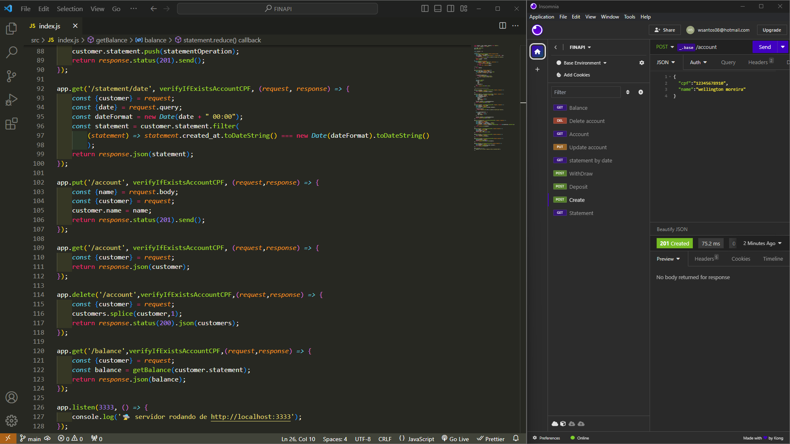

# FinAPI Bancária 🏦


*Screenshot*


## Visão Geral
Uma API RESTful simples que simula operações bancárias como criação de contas, depósitos, saques, consulta de saldo e extratos bancários. Desenvolvido com o framework Express.js, permite gerenciar clientes e suas transações de forma eficiente e prática.

- **Autor:** Wellington M Santos  
- **Data:** Novembro 2024
- **Repositório:** [https://github.com/esscova/fin-api](https://github.com/esscova/fin-api)
---

## Funcionalidades

A API oferece as seguintes rotas e funcionalidades:

1. **Criação de Conta (`POST /account`)**: Cria uma nova conta bancária usando CPF e nome.
2. **Consulta de Extrato Completo (`GET /statement`)**: Retorna o extrato completo do cliente autenticado.
3. **Depósito (`POST /deposit`)**: Adiciona uma transação de crédito ao extrato do cliente.
4. **Saque (`POST /withdraw`)**: Realiza uma transação de débito, se houver saldo suficiente.
5. **Extrato por Data (`GET /statement/date`)**: Retorna o extrato filtrado por uma data específica.
6. **Atualização de Conta (`PUT /account`)**: Permite atualizar o nome do cliente.
7. **Consulta de Conta (`GET /account`)**: Retorna informações da conta do cliente.
8. **Exclusão de Conta (`DELETE /account`)**: Exclui a conta do cliente autenticado.
9. **Consulta de Saldo (`GET /balance`)**: Retorna o saldo atual do cliente.

---

## Middleware

- **Verificação de Conta (`verifyIfExistsAccountCPF`)**: Middleware que verifica se o cliente com o CPF fornecido existe. Utilizado em várias rotas para garantir a segurança e consistência das operações.

---

## Tecnologias Utilizadas

- **Node.js** com **Express.js**: Para criação do servidor e gerenciamento das rotas.
- **UUID**: Geração de identificadores únicos para cada conta.
- **Docker**: Para conteinerização e execução da aplicação em qualquer ambiente.

---

## Como Executar o Projeto

### 1. **Executando com Docker**

O projeto pode ser facilmente executado usando Docker. Siga os passos abaixo:

#### Passo 1: Construa a imagem Docker

No terminal, na raiz do projeto, execute:

```bash
docker build -t finapi .
```

#### Passo 2: Execute o contêiner

Após construir a imagem, execute o contêiner com o seguinte comando:

```bash
docker run -p 3333:3333 finapi
```

A aplicação estará disponível em `http://localhost:3333`.

---

### 2. **Executando Localmente (sem Docker)**

Se preferir executar o projeto localmente, siga os passos abaixo:

#### Passo 1: Instale as dependências

No terminal, na raiz do projeto, execute:

```bash
yarn install
```

#### Passo 2: Inicie o servidor

Após instalar as dependências, inicie o servidor com:

```bash
yarn dev
```

O servidor estará disponível em `http://localhost:3333`.

---

## Como Utilizar os Endpoints

Abaixo estão exemplos de como utilizar os principais endpoints da API. Você pode testá-los usando ferramentas como **curl**, **Postman** ou diretamente pelo navegador.

### 1. **Criar uma Nova Conta**

- **Método**: POST
- **Endpoint**: `http://localhost:3333/account`
- **Corpo da Requisição (JSON)**:
  ```json
  {
    "cpf": "12345678900",
    "name": "João Silva"
  }
  ```

**Exemplo com curl**:
```bash
curl -X POST http://localhost:3333/account \
-H "Content-Type: application/json" \
-d '{"cpf": "12345678900", "name": "João Silva"}'
```

---

### 2. **Consultar Extrato Completo**

- **Método**: GET
- **Endpoint**: `http://localhost:3333/statement`
- **Header**: `cpf: 12345678900`

**Exemplo com curl**:
```bash
curl -X GET http://localhost:3333/statement \
-H "cpf: 12345678900"
```

---

### 3. **Realizar um Depósito**

- **Método**: POST
- **Endpoint**: `http://localhost:3333/deposit`
- **Header**: `cpf: 12345678900`
- **Corpo da Requisição (JSON)**:
  ```json
  {
    "description": "Salário",
    "amount": 1000
  }
  ```

**Exemplo com curl**:
```bash
curl -X POST http://localhost:3333/deposit \
-H "cpf: 12345678900" \
-H "Content-Type: application/json" \
-d '{"description": "Salário", "amount": 1000}'
```

---

### 4. **Realizar um Saque**

- **Método**: POST
- **Endpoint**: `http://localhost:3333/withdraw`
- **Header**: `cpf: 12345678900`
- **Corpo da Requisição (JSON)**:
  ```json
  {
    "amount": 500
  }
  ```

**Exemplo com curl**:
```bash
curl -X POST http://localhost:3333/withdraw \
-H "cpf: 12345678900" \
-H "Content-Type: application/json" \
-d '{"amount": 500}'
```

---

### 5. **Consultar Extrato por Data**

- **Método**: GET
- **Endpoint**: `http://localhost:3333/statement/date?date=2023-10-01`
- **Header**: `cpf: 12345678900`

**Exemplo com curl**:
```bash
curl -X GET "http://localhost:3333/statement/date?date=2023-10-01" \
-H "cpf: 12345678900"
```

---

### 6. **Consultar Saldo**

- **Método**: GET
- **Endpoint**: `http://localhost:3333/balance`
- **Header**: `cpf: 12345678900`

**Exemplo com curl**:
```bash
curl -X GET http://localhost:3333/balance \
-H "cpf: 12345678900"
```

---

## Observação

Para acessar as rotas protegidas pelo middleware, inclua o CPF no cabeçalho da requisição:
```json
{
  "cpf": "12345678900"
}
```

---

## Contribuição

Contribuições são bem-vindas! Sinta-se à vontade para abrir uma _issue_ ou _pull request_.

---

## Contato

Se tiver dúvidas ou sugestões, entre em contato:

- **Email**: wsantos08@hotmail.com
- **LinkedIn**: [in/wellington-moreira-santos](https://www.linkedin.com/in/wellington-moreira-santos/)
- **GitHub**: [esscova](https://github.com/esscova)
